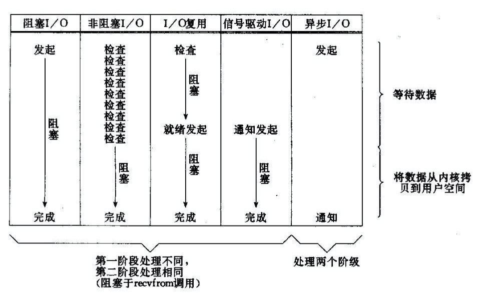

##### IO模型图

这里的非阻塞IO和IO复用的区别：
1. 非阻塞IO, 此时对应的仍然阻塞IO, 说的是单线程。单个线程，不断检查单个连接。
2. 非阻塞IO, 与IO复用。 复用表示复用线程， 一个线程不断检查多个连接。

##### 以socket.read()为例子：

1. 传统的BIO里面socket.read()，如果TCP RecvBuffer里没有数据，函数会一直阻塞，直到收到数据，返回读到的数据。
2. 对于NIO，如果TCP RecvBuffer有数据，就把数据从网卡读到内存，并且返回给用户；反之则直接返回0，永远不会阻塞。
3. 最新的AIO(Async I/O)里面会更进一步：不但等待就绪是非阻塞的，就连数据从网卡到内存的过程也是异步的。
> 换句话说，BIO里用户最关心“我要读”，NIO里用户最关心"我可以读了"，在AIO模型里用户更需要关注的是“读完了”。

