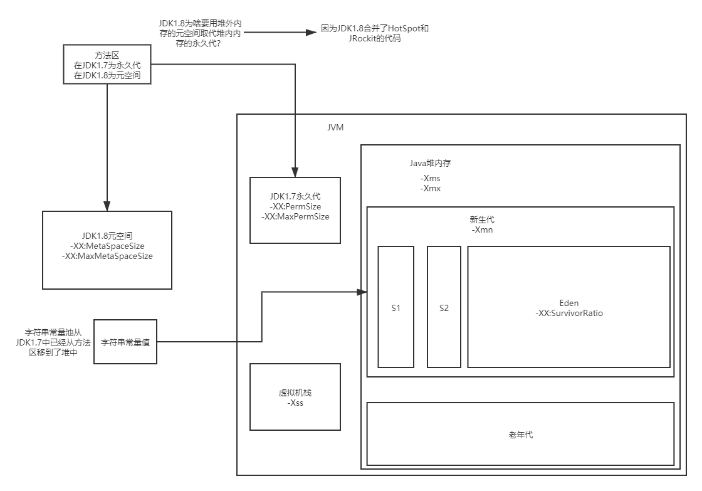

## JVM

#### 内存区域
##### 程序计数器
线程独占
##### 虚拟机栈
线程独占
##### 本地方法栈
线程安全
##### 堆
线程共享
##### 方法区
线程共享
##### 堆外内存

#### 各种常量池 

##### 字符串常量池

#### 新生代、老年代

##### 垃圾回收流程
1. 对象优先分配到新生代
2. 新生代如果满了，会触发Minor GC回收掉没人引用的垃圾对象
3. 如果对象在15次（默认）还没有被回收掉，会进入老年代中。
4. 如果老年代也满了，那么也会触发垃圾回收，把老年代里没有被引用的对象回收掉。

#### JVM参数

##### 基础参数
1. -xms
2. -xmx
3. -xmn
4. -xss
5. -XX:PermSize
6. -XX:MaxPermSize