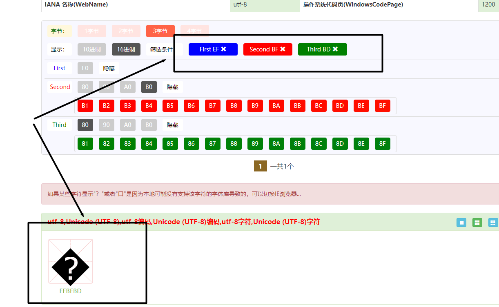

### 问题描述

最近遇到了一个Byte数组转String的Bug，具体情况是这样的，有一个java项目使用到了Hbase，rowKey是由4个随机字节 + 4个字节的hashKey.length（字节） + hashKey（字节） + rangeKey（字节） 组成的。从Hbase取出rowKey后转为了String， 然后在另外一处又将String转为Byte，准备把hashKey和rangeKey取出来展示，但是却发现转化为Byte数组后，Byte数组的长度变长了， 比转化为String的Byte数组多了两个字节。

### 为什么字节多了两位

因为我的电脑的字符编码为UTF-8编码， UTF-8编码是可变长编码，并且UTF-8编码并不是连续的，所以在使用byte转String的时候会出现无效的编码值，

例如, 下列的代码，我用了一段随意写的byte数组。并把它转为String后再转为Byte数组

```java
        byte[] b = {-111,123,75,99,3,-76,13};
        for (byte aByte : new String(b).getBytes()) {
            System.out.print(aByte + "   ");
        }
```

下面是代码输出的内容

> -17   -65   -67   123   75   99   3   -17   -65   -67   13

我们发现原始byte数组的 -111 和 -76 变为了 -17 -65 -67。

为什么会这样呢？

我们可以查阅utf-8码表。我们需要把-17，-65， -67 转化为正数后再转化为16进制。

```java
        System.out.println(-17 & 0xff); // & oxff 和 补码有关
        System.out.println(-65 & 0xff);
        System.out.println(-67 & 0xff);
```

输出结果：

>    191  189

转化为16进制为    

> EF   BF    BD

然后在[编码大全](https://www.mp51.vip/Code?code=utf-8&CodePage=65001)中可以输入分别输入EF BF BD 三个十六进制。

我们会发现如下图所示： 


然后通过谷歌查询到，当遇到上文提到的无效编码值，java语言会将无效的编码值转化为EFBFBD.
也就是�。
由此我们也就知道为什么有些byte数组转String后，byte数组的长度发生了变化。
   


